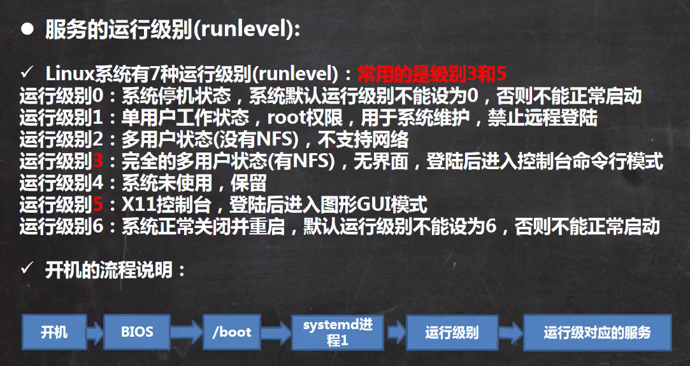

# 1. Linux 命令

## 目录

-   [1. 文件管理](#1-文件管理)
    -   [1.1 浏览目录](#11-浏览目录)
        -   [pwd 查看当前路径](#pwd-查看当前路径)
        -   [cd 定位到指定目录](#cd-定位到指定目录)
        -   [ls 列出当前目录下的文件](#ls-列出当前目录下的文件)
        -   [tree 树状结构列出目录](#tree-树状结构列出目录)
    -   [1.2 预览文件](#12-预览文件)
        -   [cat 查看文件内容](#cat-查看文件内容)
        -   [more 分页浏览](#more-分页浏览)
        -   [less 预览文本](#less-预览文本)
        -   [head 查看前10行](#head-查看前10行)
        -   [tail 查看末尾10行](#tail-查看末尾10行)
        -   [file 查看文件类型](#file-查看文件类型)
        -   [du 查看占用空间](#du-查看占用空间)
        -   [wc 字符统计](#wc-字符统计)
        -   [md5sum 查看md5](#md5sum-查看md5)
    -   [1.3 创建删除](#13-创建删除)
        -   [touch 创建空白文件](#touch-创建空白文件)
        -   [mkdir 创建目录](#mkdir-创建目录)
        -   [rm 删除文件](#rm-删除文件)
        -   [ln 创建软连接](#ln-创建软连接)
    -   [1.4 复制移动](#14-复制移动)
        -   [cp 复制文件](#cp-复制文件)
        -   [mv 移动文件](#mv-移动文件)
    -   [1.5 压缩与解压](#15-压缩与解压)
        -   [zip 压缩文件](#zip-压缩文件)
        -   [unzip 解压文件](#unzip-解压文件)
        -   [zcat 查看压缩文件内容](#zcat-查看压缩文件内容)
        -   [zipinfo 列出zip详细信息](#zipinfo-列出zip详细信息)
        -   [gzip 压缩文件（.gz）](#gzip-压缩文件gz)
        -   [gunzip  解压文件（.gz）](#gunzip--解压文件gz)
        -   [tar 打包文件（.tar.gz）](#tar-打包文件targz)
-   [2. 文本处理](#2-文本处理)
    -   [2.1 查找](#21-查找)
        -   [find 查找文件](#find-查找文件)
        -   [grep 查找文本](#grep-查找文本)
        -   [which 查看命令的本地路径](#which-查看命令的本地路径)
-   [3. 终端显示](#3-终端显示)
    -   [clear 清屏](#clear-清屏)
    -   [echo 输出文本](#echo-输出文本)
    -   [printf 格式化输出](#printf-格式化输出)
    -   [history 命令历史记录](#history-命令历史记录)
    -   [man 查看帮助](#man-查看帮助)
    -   [alias 别名](#alias-别名)
    -   [type 显示别名和所在位置](#type-显示别名和所在位置)
    -   [bc 交互式计算器](#bc-交互式计算器)
-   [4. 系统相关](#4-系统相关)
    -   [4.1 环境变量](#41-环境变量)
        -   [export 添加临时变量](#export-添加临时变量)
        -   [source 激活永久配置](#source-激活永久配置)
    -   [4.2 用户相关](#42-用户相关)
        -   [whoami 查看当前用户](#whoami-查看当前用户)
        -   [su 使用管理员用户](#su-使用管理员用户)
        -   [passwd 更改密码](#passwd-更改密码)
        -   [logout 注销登录](#logout-注销登录)
        -   [useradd 添加用户](#useradd-添加用户)
        -   [usermod 修改用户信息](#usermod-修改用户信息)
        -   [userdel 删除用户](#userdel-删除用户)
        -   [groupadd 添加组](#groupadd-添加组)
        -   [groupdel 删除组](#groupdel-删除组)
        -   [groupmod 修改组名](#groupmod-修改组名)
        -   [passwd 设置密码](#passwd-设置密码)
        -   [sudo 管理员身份执行命令](#sudo-管理员身份执行命令)
        -   [id 查看用户信息](#id-查看用户信息)
    -   [4.3 时间日期](#43-时间日期)
        -   [date 显示当前日期](#date-显示当前日期)
        -   [cal 显示月历](#cal-显示月历)
        -   [sleep 延时（秒）](#sleep-延时秒)
    -   [4.4 包管理](#44-包管理)
        -   [4.4.1 apt](#441-apt)
        -   [4.4.2 rpm](#442-rpm)
        -   [4.4.3 yum](#443-yum)
        -   [4.4.4 snap](#444-snap)
    -   [4.5 进程管理](#45-进程管理)
        -   [ps 查看进程列表](#ps-查看进程列表)
        -   [top 交互式显示进程](#top-交互式显示进程)
        -   [pstree 树状图显示进程](#pstree-树状图显示进程)
        -   [kill 结束进程](#kill-结束进程)
        -   [4.5.1 后台运行](#451-后台运行)
            -   [&](#)
            -   [bg](#bg)
            -   [nohup](#nohup)
    -   [4.6 服务](#46-服务)
        -   [service 服务操作](#service-服务操作)
        -   [systemctl 管理服务](#systemctl-管理服务)
    -   [4.7 网络相关](#47-网络相关)
        -   [ifconfig 查看网卡信息](#ifconfig-查看网卡信息)
        -   [ping 测试网络连通性](#ping-测试网络连通性)
        -   [ssh 远程登录](#ssh-远程登录)
        -   [wget 下载文件](#wget-下载文件)
        -   [curl 网络请求](#curl-网络请求)
        -   [关闭防火墙](#关闭防火墙)
        -   [查看端口占用](#查看端口占用)
        -   [全局代理](#全局代理)
-   [5. Shell 编程](#5-Shell-编程)
    -   [5.1 系统变量](#51-系统变量)
    -   [5.2 定义变量](#52-定义变量)

[1.1 vim](https://www.wolai.com/8NKqVAxFqNrTUF78ZRbm8h "1.1 vim")

# 1. 文件管理

运行文件（必须有执行权限）：

```bash
./文件名
```

## 1.1 浏览目录

#### `pwd` 查看当前路径

#### `cd` 定位到指定目录

```bash
  ~ 主目录（当前用户）
  . 当前目录
  .. 上级目录
  / 根目录
```

#### `ls` 列出当前目录下的文件

```bash
-a    # 列出所有文件（包括隐藏文件）
-A    # 列出所有文件（不包括当前目录和父目录： .  /  .. ）
-r    # 逆序排列
-R    # 递归列出子目录
-F    # 区分文件类型（/：目录，*：可执行文件，@：符号链接）
-S    # 按内容大小排序
-l    # 显示详细信息
-1    # 单列展示
-lh   # 显示文件大小单位
-t    # 按修改时间降序
-x    # 按拓展名排序（相同拓展名的文件在一起）

ls <路径>    # 列出指定目录下的文件
ls a* # 通配符：列出 a 开头的文件
  ?   # 表示任意一个字符
```

#### `tree` 树状结构列出目录

```bash
-a 列出所有文件
  -d 仅显示目录
  -f 显示完整路径
  -i 不以树状图显示（列表）
  -p 显示文件权限
  -C 以不同的颜色区分类型
  -h 显示文件大小和单位
```

## 1.2 预览文件

#### `cat` 查看文件内容

```bash
-n  显示行号
```

#### `more` 分页浏览

```bash
<命令> | more  翻页查看命令结果
操作：
  空格：向下翻一页
  回车：向下翻一行
  q：退出
  b：向上滚动一屏
```

#### `less` 预览文本

```bash
-N 显示行号
-m 显示百分比
b / PgUp  向上翻页
d / PgDwon  向下翻页
j / enter 向下一行
k 向上一行
u 向上半页
d 向下半页
g 移至顶行
G 移至末尾
/<xxx>  查找字符
  n 下一个
  N 上一个
?<xxx>  向上查找
q：退出
```

#### `head` 查看前10行

```bash
-n <行数>  查看前n行
```

#### `tail` 查看末尾10行

```bash
-n <行数>  查看后n行
-f 实时输出新增行
```

#### `file` 查看文件类型

#### `du` 查看占用空间

> 支持文件和目录。

```bash
-h  显示单位
-a  列出目录下所有文件的占用空间
-c  显示总计
```

#### `wc` 字符统计

```bash
 wc <文件名>
   -l 统计行数
   -w 统计单词数
   -m 统计字符数
```

### `md5sum` 查看md5

```bash
md5sum <文件>
```

## 1.3 创建删除

#### `touch` 创建空白文件

```bash
touch <文件名>
```

#### `mkdir` 创建目录

```bash
-p 创建多级目录
```

#### `rm` 删除文件

```bash
-r  删除子目录中的文件
-f  强制删除
* 统配符（删除所有文件）
```

#### `ln` 创建软连接

> 类似于 win 的符号链接

```bash
ln -s <原文件> <软连接名>
```

## 1.4 复制移动

#### `cp` 复制文件

```bash
cp <旧文件> <新文件>
 -r 包括子文件
 -v 显示操作信息
 -i 询问是否覆盖
```

#### `mv` 移动文件

> 也可用于重命名

```bash
mv <旧文件> <新文件>
```

## 1.5 压缩与解压

#### `zip` 压缩文件

```bash
zip <压缩后路径> <文件>
  -m 压缩后删除原文件
  -r 包括子目录
```

#### `unzip` 解压文件

```bash
unzip <压缩文件> 解压文件
  -d 解压到指定目录
  -v 查看压缩文件，不解压
```

#### `zcat` 查看压缩文件内容

#### `zipinfo` 列出zip详细信息

#### `gzip` 压缩文件（.gz）

> gzip 不会保留文件名信息，将删除原文件。

```bash
-d 解压文件
-v 显示文件名和压缩比  
```

#### `gunzip`  解压文件（.gz）

> 将删除原文件。

#### `tar` 打包文件（.tar.gz）

```bash
tar -c <文件> -f <压缩文件路径>
  -v 显示详细信息
  -z 打包的同时压缩
  -x 解压.tar文件
tar xf  <压缩文件>  解压.tar文件
tar xzf  <压缩文件>  解压.tar.gz文件
```

# 2. 文本处理

```bash
sed <选项> <文件>  # 文本处理
  sed 's/原字符串/新字符串/g'  # 替换文本

expand <文件名>  将制表符转为空格预览
  -t <数字> 制定制表符长度
   
sort <文件名>  文本排序
   -r 逆序
   -u 合并相同行
   
uniq <文件名> 合并相同行
   -c 显示出现次数
   -d 只显示重复的行
   -u 只显示不重复的行
   -i 不区分大小写

diff <文件1> <文件2>  逐行对比文本
  -b 忽略行尾空格
  -w 忽略所有空白
  -i 忽略大小写
  
cmp <文件1> <文件2>  按字节对比文件
```

## 2.1 查找

#### `find` 查找文件

```bash
find <关键词>  当前位置查找文件
find <路径> <关键词>  指定查找路径
find *.text  使用通配符
  -name <关键词>  按文件名查找（递归查找）
  -user <用户名>  查找指定用户名的文件
  -size <大小>  按文件大小查询
    +20M  20M以上的文件（不加+表示精确查找）
  -empty 查找空文件
 
```

#### `grep` 查找文本

> 高亮匹配项，使用双引号可支持正则表达式匹配。

```bash
grep <关键词> <文件名>
xxx | grep <关键词>  在前一条命令的结果中查找
  -n  显示行号
  -i  忽略大小写
  -c 只显示匹配的行数
  -v 显示不匹配的行
```

#### `which` 查看命令的本地路径

# 3. 终端显示

#### `clear` 清屏

#### `echo` 输出文本

```bash
echo <文本>  输出文本
  -e  使用转义字符
    \c 末尾不换行
  -E  不转义
  -n  输出不换行
  echo $PATH  输出变量内容
  echo $SHELL    查看当前终端
  >  输出到文件
  >> 追加到文件
```

#### `printf` 格式化输出

#### `history` 命令历史记录

```bash
-c 清除历史记录
n  查看最近n条指令
!<编号>  执行第几条命令
!! 执行上一条命令
!-<编号> 执行倒数第几条命令
```

#### `man` 查看帮助

```bash
man <命令>
sudo apt install manpages-zh  # 下载中文版

```

#### `alias` 别名

```bash
alias <别名>=<命令>    # 指定别名（可以带参数）
unalias               # 取消别名

```

#### `type` 显示别名和所在位置

```bash
type <命令>
  -a 显示所有可能的来源
```

#### `bc` 交互式计算器

```bash
quit  # 退出
```

# 4. 系统相关

```bash
shutdown -h now  立刻关机
shutdown -h 1  1分钟后关机
shutdown -c  取消定时关机
shutdown -r now  立刻重启
reboot  重启

poweroff 关闭系统

sync  将内存数据同步到磁盘

uname  显示系统信息
  -a  显示全部信息
  -m  显示硬件架构
  -n  显示主机名
  -v  显示内核信息
  
cat /etc/issue   查看ubuntu版本 
   
hostname <主机名>  修改主机名
  hostname  显示主机名
  
init <序号>  设置运行级别（最常用3和5）
  0：关机
  1：单用户
  2：多用户无网络
  3：多用户有网络
  4：系统未使用保留给用户
  5：图形界面
  6：系统重启
  
# 关闭sheel响铃（centos）
# 可以在系统启动的时候把“rmmod pcspkr”命令放在/etc/rc.d/rc.local文件中
```

## 4.1 环境变量

#### `export` 添加临时变量

```bash
export PATH=$PATH:路径
```

#### `source` 激活永久配置

**添加永久环境变量**：

-   profile 文件对所有用户生效，会在系统启动时执行。
-   使用source可以无需重启系统，使配置生效。

```bash
vim /etc/profile  # 编辑环境变量
  # 末尾加上 export PATH=$PATH:路径 
source /etc/profile  # 激活配置
```

## 4.2 用户相关

#### `whoami` 查看当前用户

#### `su` 使用管理员用户

> 退出：exit

```bash
su <用户名>  # 登录其他用户
```

#### `passwd` 更改密码

#### `logout` 注销登录

#### `useradd` 添加用户

```bash
useradd <用户名>  添加用户（将在/home下创建用户主目录）
  -g <组名>  在指定组添加用户
  -m 如果没有主目录则自动创建
```

#### `usermod` 修改用户信息

```bash
usermod <选项> <用户名> 修改用户信息
  -g <组名> 修改用户所属的组
  -l <新用户名> 修改用户名
  -d <路径> 指定新的主目录
  -m 移动主目录的位置（配合 -d 使用）
```

#### `userdel` 删除用户

```bash
userdel <用户名>  删除用户
  -r  删除用户和主目录
```

#### `groupadd` 添加组

#### `groupdel` 删除组

#### `groupmod` 修改组名

```bash
groupmod <组名> -m <新组名>
```

#### `passwd` 设置密码

```bash
passwd <用户名>
  -d    # 删除密码

```

#### `sudo` 管理员身份执行命令

```bash
-u <用户名>    # 指定用户身份
```

#### `id` 查看用户信息

## 4.3 时间日期

#### `date` 显示当前日期

```bash
+%Y  # 显示当前年份
+%m  # 显示当前月份
+%d  # 显示当前是哪一天
"+%Y-%m-%d %H:%M:%S"  # 组合格式（简化："+%F %T"）
```

#### `cal` 显示月历

```bash
  -y 显示年历
cal <年份>  指定年份
```

#### `sleep` 延时（秒）

## 4.4 包管理

### 4.4.1 apt

> 换源：
> [https://blog.csdn.net/xiangxianghehe/article/details/122856771](https://blog.csdn.net/xiangxianghehe/article/details/122856771 "https://blog.csdn.net/xiangxianghehe/article/details/122856771")[https://blog.csdn.net/fengyuyeguirenenen/article/details/128197920](https://blog.csdn.net/fengyuyeguirenenen/article/details/128197920 "https://blog.csdn.net/fengyuyeguirenenen/article/details/128197920")[https://developer.aliyun.com/mirror/ubuntu?spm=a2c6h.13651102.0.0.3e221b11JmfFir](https://developer.aliyun.com/mirror/ubuntu?spm=a2c6h.13651102.0.0.3e221b11JmfFir "https://developer.aliyun.com/mirror/ubuntu?spm=a2c6h.13651102.0.0.3e221b11JmfFir")

```bash
查询安装的包
dpkg --get-selections | grep -i <包名>

apt install <包名>  添加包
apt search <包名>  搜索包
apt list --installed  列出已安装的包
apt list --upgradeable  列出可升级的包
apt remove <包名>  移除包
apt purge <包名>  移除包和配置文件
apt show <包名>  显示包的详细信息
apt upgrade <包名>  更新包（无参数更新所有包）
apt update <包名>  更新包列表
```

安装vm tools：

```bash
sudo apt install open-vm-tools
sudo apt install open-vm-tools-desktop
```

### 4.4.2 rpm

```bash
rpm -q <包名>  查询软件包是否安装
rpm -qa | grep <包名>  查找已安装的包
rpm -qi <包名>  查询包的信息
rpm -ql <包名>  查询软件包安装后的文件
rpm -qf <文件>  查询文件归属于哪个软件包

rpm -e <包名>  删除包
  --nodeps 强制删除，忽略依赖问题
rpm -vih <包路径>  本地安装包
```

### 4.4.3 yum

```bash
yum list  列出可安装的包
yum list installed  列出已安装的包
yum search <包名>  查找包
yum install <包名>  下载并安装包（自动安装依赖）
  -y 所有操作都选择yes

```

### 4.4.4 snap

```bash
snap install <包名>  安装软件包
snap list  列出已安装的包
snap find <包名>  查找包
snap refresh <包名>  更新包
snap remove <包名>  卸载包
```

## 4.5 进程管理

#### `ps` 查看进程列表

```bash
e    # 显示进程的环境变量
c    # 只显示进程名，不显示命令行参数
a    # 显示当前终端的所有进程（包括其他用户）
-a   # 列出所有终端下的进程（ 除作业领导者之外）
-A   # 显示所有进程
-l   # 显示详细信息
-x   # 显示后台进程
-u   # 显示用户和其他详细信息
-f   # 显示 PPID,C,STIME 等信息，以及命令行参数（PPID：父进程，STIME：开始时间）

```

#### `top` 交互式显示进程

```bash
q 退出
```

#### `pstree` 树状图显示进程

```bash
-p 显示pid
-u 显示所属用户
```

#### `kill` 结束进程

```bash
kill <进程号>
kill -9 <进程号>  # 强制结束
killall <进程名>  # 通过进程名结束进程
```

### 4.5.1 后台运行

#### `&`

-   关闭终端后，进程结束运行。

```bash
<命令> &
```

#### `bg`

-   关闭终端后，进程结束运行。
-   步骤：
    1.  Ctrl + Z 暂停任务
    2.  运行 `bg` 将任务挂载到后台。

#### `nohup`

-   关闭终端后，进程依旧保持运行。

```bash
nohup <命令> &
```

```bash
nohup <命令> 1> out.log 2>&1 &   # 输出结果到日志
```

查看后台进程（当前终端）：

```bash
jobs
  -l    # 显示 pid

```

将后台进程调往前台：

> 省略编号，默认为最后一个。

```bash
fg [编号]
```

## 4.6 服务

服务的本质就是进程，但是运行在后台，通常会监听某个端口，等待其他进程的请求（如mysqld、sshd）。这样的进程又称为守护进程。

#### `service` 服务操作

> CentOS7.0后的很多服务不再使用service，而是systemctl。
> 查看service支持的服务：ls -l /etc/init.d/

```bash
service <服务名> <操作>  对服务进行操作
    start 启动服务
    stop 停止服务
    restart 重启服务
    reload 重新载入服务配置
    status 查看服务状态
    --status-all 查看所有服务运行状态
```

#### `systemctl` 管理服务

> systemctl管理的服务在 `/usr/lib/systemd/system`下查看

```bash
systemctl <start|stop|restart|status> <服务名>
  list-unit-files  # 查看服务自启动状态
  enable <服务名>   # 设置服务自启动
  disable <服务名>  # 关闭服务开机自动
  is-enabled <服务名> # 查看服务是否自启动
```



## 4.7 网络相关

#### `ifconfig` 查看网卡信息

提示没有命令，则安装：`net-tools`

#### `ping` 测试网络连通性

> 默认持续测试，需要手动停止。

```bash
ping <ip或主机>
  -c <次数>  # 指定执行次数
  -i <秒数>  # 指定每个包的间隔时间
  -w <秒数>  # 指定超时时间

```

#### `ssh` 远程登录

> 删除连接缓存：`rm ~/.ssh/known_hosts`

```bash
ssh <用户名>@<ip>    # 远程登录
  -p <端口>          # 指定端

```

### `wget` 下载文件

```bash
wget <url>
  -O <文件名>          # 保存到指定路径
  -b                  # 后台下载
  --limit-rate=300k   # 限制下载速度
  --spider            # 查看远程文件信息
  -e http_proxy=ip:port    # 使用代理
```

### `curl` 网络请求

> 相关文章：
> [https://www.cnblogs.com/leizia/p/16322061.html](https://www.cnblogs.com/leizia/p/16322061.html "https://www.cnblogs.com/leizia/p/16322061.html")[https://juejin.cn/post/7210320199690305596](https://juejin.cn/post/7210320199690305596 "https://juejin.cn/post/7210320199690305596")

```bash
curl <url>    # http 请求（返回响应内容）
  -X POST  # 指定请求方法
  -o <文件>  # 将响应内容写入文件
  curl url > out.html  # 使用重定向保存文件
  -O  # 以服务器上的名称保存图片
  curl -O http://img[1-5].jpg  # 下载指定 url 范围的文件
  -s  # 不显示进度信息
  -i  # 获取请求头 
  -L  # 启用重定向
  -T <file>  # 上传文件
  -H "xx:xx"  # 添加请求头
  -d "xx=xx&xx=xx"  # 提交数据
  -d "{"xx":"xx"}"  # 提交json数据
  -u name:passwd  # 指定用户名和密码
  -w  # 输出指定内容
    -w %{http_code}  # 输出状态码
  -A ""  # 指定UA（user-agent）
  -e <url>  # 指定 referer
  --proxy ""  # 使用代理
  -x <代理ip>  # 指定代理服务器

```

### 关闭防火墙

```bash
systemctl stop firewalld.service
```

### 查看端口占用

```bash
netstat -ano | grep 端口号
```

```bash
lsof -i:端口号
```

### 全局代理

```bash
export http_proxy=http://127.0.0.1:端口
```

# 5. Shell 编程

```bash
vim 1.sh  # 编写脚本文件
chmod +x 1.sh  # 添加运行权限
./1.sh  # 运行脚本

sh 1.sh  # 运行脚本（不用加运行权限）
```

## 5.1 系统变量

```bash
$HOME  当前用户主目录
$LANG  系统文本编码
$PATH  环境变量
$PWD  当前目录
```

## 5.2 定义变量

> 编程规范：变量名使用大写。

```bash
变量名=值  # 定义变量
unset 变量名  # 取消变量定义
echo $变量名  # 使用变量
echo "$变量名"  # 引号中的变量依然发挥作用

变量名=`命令`  # 将命令的结果赋给变量
变量名=$(命令)  # 与 ` ` 等价
```
