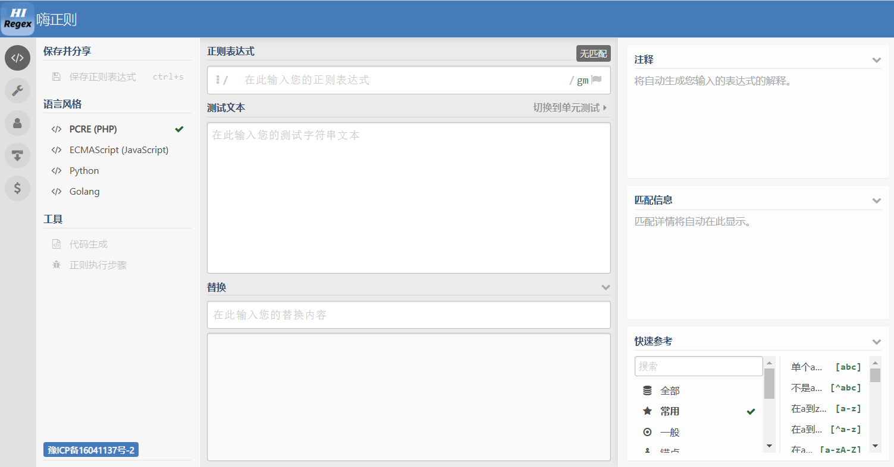
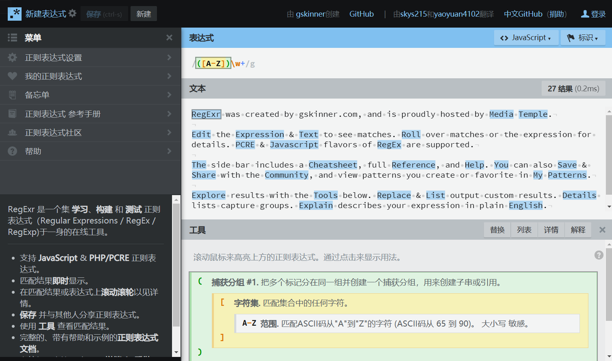
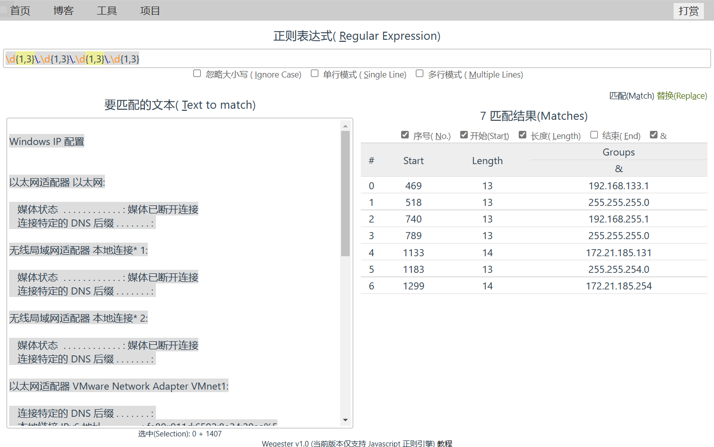
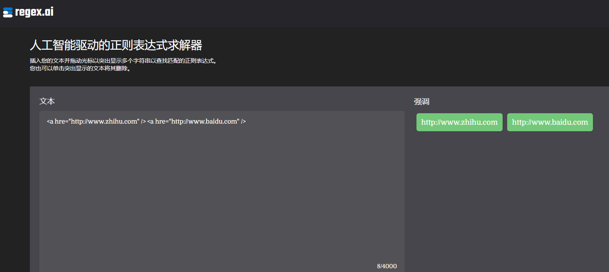
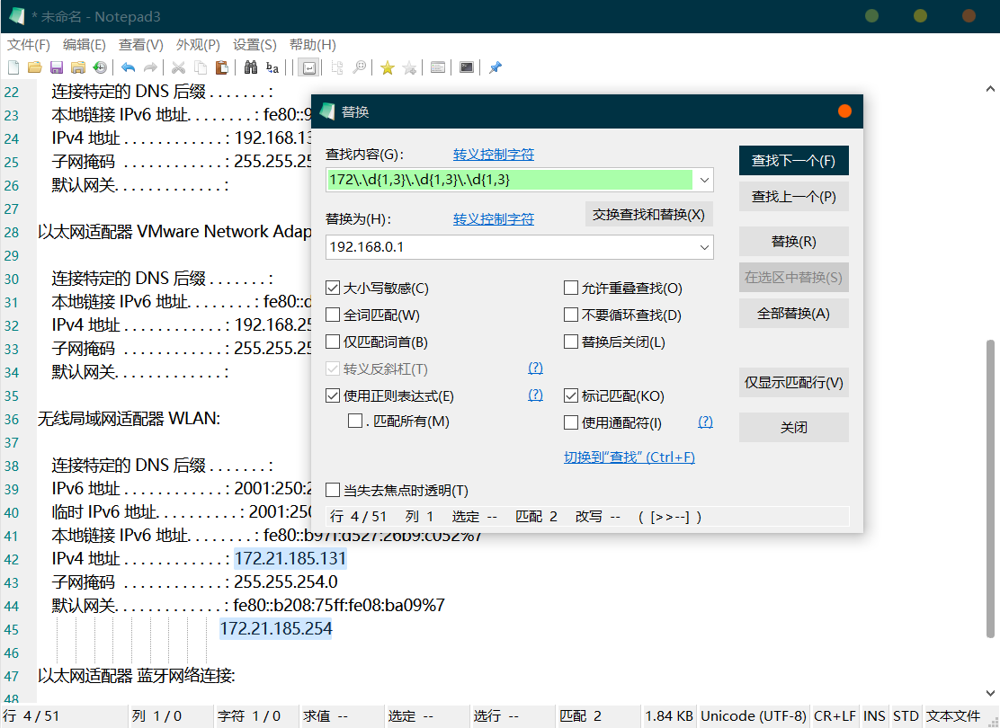
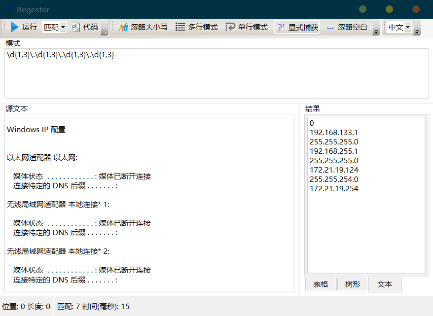

# 正则表达式

> 正则表达式是一种匹配字符串的规则，可以和编程语言配合使用。

正则引擎兼容性：[https://deerchao.cn/tutorials/regex/diffs.html](https://deerchao.cn/tutorials/regex/diffs.html "https://deerchao.cn/tutorials/regex/diffs.html")

正则表达式的匹配由**普通字符**和**特殊字符**组成。

1.  普通字符：如输入 `hello` ，就会匹配到字符串：`hello`。
2.  特殊字符：搭配普通字符使用，可以实现特定的规则。

# 1. 单字匹配

## 1.1 字符集

1.  `[]` 匹配一个字符，内部的字符是**或**的关系。
    -   如 `[ab]` 可以同时匹配 `a` 和 `b`两个字符，书写顺序不影响结果。
2.  在`[]` 中`.`、`+`、`*` 等作普通字符，转义字符可以正常使用。
3.  在前面加上`^`可以反向匹配，如 `[^ab]`：匹配除`a`、`b`以外的字符。
    -   如需匹配 `^` 这个字符，写在开头以外的位置就行。
4.  使用 `-` 可以匹配一个区间（Unicode字符顺序），如`0-9`可以匹配所有数字。

**示例：**

| ******代码**           | ******作用**        |
| -------------------- | ----------------- |
| ******\[abc]**       | 单字匹配（匹配a、b、c任意一个） |
| ******\[^abc]**      | 匹配除 a、b、c 以外的元素   |
| **\[0-9]**           | 匹配 0 到 9 的区间      |
| ******\[a-z]**       | 匹配小写字母            |
| ******\[a-zA-Z]**    | 匹配所有字母            |
| ******\[\uxx-\uxx]** | 匹配unicode区间       |

并集和差集：

| ******\[1-3\[7-9]]**    | 并集            |
| ----------------------- | ------------- |
| ******\[1-9&&\[^4-6]]** | 交集，从1-9中排除4-6 |

## 1.2 转义字符

想要匹配正则表达式中的特殊字符，则需要进行转义。

1.  在特殊字符前加上 `\` 进行转义。
    -   如 `\[` 可以匹配`[`，使用`\\`可以匹配 `\`。
2.  在正则表达式中，内置了一些特殊的转义字符：
    | ******代码**     | ******作用**      |
    | -------------- | --------------- |
    | ******\d**     | 匹配数字，等同于 \[0-9] |
    | ******\w**     | 字母、数字、下划线       |
    | ******\s**     | 空白字符（空格、制表符）    |
    | ******\r**     | 回车              |
    | ******\n**     | 换行符             |
    | ******\t**     | 制表符             |
    | ******\u十六进制** | Unicode字符       |
3.  反向匹配：将部分转义字符的字母大写可以反向匹配。
    -   如 `\D`可以匹配非数字的字符。

用例：

| **代码**           | **作用**        |
| ---------------- | ------------- |
| **\[\s\S]**      | 匹配所有字符（包括换行符） |
| **\r\n**         | windows换行     |
| **\r\n\s\*\r\n** | 匹配空行          |

## 1.3 边界

可以匹配行首、行尾、文章前、文章尾等。

示例：`^\d+$`可以匹配全是数字的行。

| ******代码** | ******作用**                      |
| ---------- | ------------------------------- |
| ******^**  | 行的开始                            |
| ******\$** | 行的末尾                            |
| ******\b** | 单词边界(`\w`以外的内容)，不含 **`-`**(连字符) |
| ******\A** | 字符串开头（类似^，但不受处理多行选项的影响）         |
| ******\Z** | 字符串结尾或行尾（不受处理多行选项的影响）           |
| ******\z** | 字符串结尾（类似\$，但不受处理多行选项的影响）        |
| ******\G** | 搜索的开头                           |

-   `\Q`和`\E`之间的字符会被当做普通字符

# 2. 量词

## 2.1 指定匹配次数

1.  正则中的 `.` 可以匹配任意一个字符，类似于通配符的作用。
    -   搭配 `*` 和 `+` 可以匹配多个字符。
2.  量词只会指定前一个字符的匹配次数
    -   如 `a*` 匹配相连的 0\~n 个 `a`，像这样：`aaaaaa`。
3.  如需影响多个字符，需要使用分组：`(ab)*`。

| **代码**    | **作用**            |
| --------- | ----------------- |
| **.**     | 匹配任意一个字符（除换行外）    |
| **\***    | 匹配 0 次或多次（0\~n）   |
| **+**     | 匹配 1 次或多次（1\~n）   |
| **?**     | 匹配 0 次或 1 次（0\~1） |
| **{n}**   | 匹配n次              |
| **{n,}**  | 匹配最少n次            |
| **{,n}**  | 匹配最多n次            |
| **{n,m}** | 匹配n到m次            |

示例：**`https?`**可以匹配到**`http`**和**`https`****。**

## 2.2 贪婪限定

1.  量词都是贪婪的，会尽可能多的匹配。
    -   在后面加上`?`，限制贪婪，只匹配最近的结果。
2.  如匹配 html 标签：`...</img>`
    -   使用`<.+>`会匹配到一整行，正确的写法是：`<.+?>`。
    -   `+`默认会匹配到最远的 `>`，使用`?`进行限定才会匹配到最近的 `>`。

| ******代码**     | ******作用**       |
| -------------- | ---------------- |
| \*******?**    | 重复任意次，但尽可能少重复    |
| ******+?**     | 重复1次或更多次，但尽可能少重复 |
| ******??**     | 重复0次或1次，但尽可能少重复  |
| ******{n,m}?** | 重复n到m次，但尽可能少重复   |
| ******{n,}?**  | 重复n次以上，但尽可能少重复   |

# 3. 分支

| **代码**   | **作用**      |
| -------- | ----------- |
| **a\|b** | 或运算，匹配多个关键字 |

-   `win7|win10`可以匹配 `win7` 和 `win10` 两个字符串。
-   利用分组可以简写为：`win(7|10)`

# 4. 分组和断言

## 3.1 捕获分组

分组可以将字符串作为一个整体处理，如：`(ab)*` 可以匹配`abab`。

| ******代码**         | ******作用** |
| ------------------ | ---------- |
| ******(abc)**      | 分组，作为一个整体  |
| ******(?****abc)** | 分组命名       |
| ******\$name**     | 引用命名       |
| ******(?#注释)**     | 注释         |

## 3.2 引用

| **代码**           | **作用**      |
| ---------------- | ----------- |
| **\num 或 \$num** | 引用，代表分组中的内容 |

1.  例如使用`\1`可以代表分组 1 的内容。
2.  在匹配HTML标签时：
    -   使用 `<(.+)>.*</\1>` 即可保证前后的标签名一致。`\1`表示`(.+)`匹配的内容。
3.  在替换中使用：
    -   查找：`=(.+)` ，替换：`="\1"`
    -   就能把 `=xx` 替换为 `="xx"`。

**各类编程语言中的引用写法：**

| ******语言**     | ******查找中的引用** | ******替换中的引用** |
| -------------- | -------------- | -------------- |
| **C#**         | \num           | \$num          |
| **Java**       | \num           | \$num          |
| **JavaScript** | \$num          | \$num          |
| **PHP**        | \num           | \num或\$num     |
| **Python**     | \num           | \num           |

## 3.3 非捕获分组

| ******代码**       | ******作用**         |
| ---------------- | ------------------ |
| ******(?:匹配内容)** | 正常匹配，但不被 `\num` 引用 |

1.  非捕获分组不会占用正常分组的序号，不能被引用。
2.  优点：不存储匹配的内容，降低内存占用。
3.  在编程语言中，可以确保结果无误：
    -   如在Python中：`win(7|10)` 查找 `` `win7` ``，返回了分组中的`7`。
    -   使用非捕获分组：`win(?:7|10)`，得到了理想的 `win7`。

## 3.4 断言

注意：括号里必须是固定的长度，不能有`*`或`+`等不定长的量词。

1.  肯定断言：
    | ******代码**         | ******作用**    |
    | ------------------ | ------------- |
    | ******内容(?=关键字)**  | 匹配结果不包含后面的关键字 |
    | ******(?<=关键字)内容** | 匹配结果不包含前面的关键字 |
2.  否定断言：
    | ******代码**              | ******作用**   |
    | ----------------------- | ------------ |
    | ******内容(?!关键字)**       | 匹配后面不含关键字的内容 |
    | ******(?\<!关键字)内容**     | 匹配前面不含关键字的内容 |
    | ******内容((?!关键字).)+内容** | 中间不含关键字的内容   |

# 5. 修饰符

注意：单行模式下，`.` 可以匹配换行符。

| ******选项**      | ******作用** |
| --------------- | ---------- |
| ******(?i)**    | 不区分大小写     |
| ******(?J)**    | 允许重复的名字    |
| ******(?m)**    | 多行         |
| ******(?s)**    | 单行         |
| ******(?u)**    | Unicode    |
| ******(?U)**    | 默认最短匹配     |
| ******(?x)**    | 忽略空格和注释    |
| ******(?-...)** | 复原或关闭选项    |

用例：

| **用例**            | **作用**       |
| ----------------- | ------------ |
| ******(?i)abc**   | 只对后面的内容有效    |
| ******((?i)a)bc** | 圈定作用范围       |
| ******(?i:a)bc**  | 只对括号内的关键字起作用 |
| ******(?-i)**     | 失效修饰符，区分大小写  |

# 6. Posix字符组

支持该特性的工具较少。

| ******字符簇**            | ******描述**    |
| ---------------------- | ------------- |
| ******\[\[:alpha:]]**  | 匹配字母          |
| ******\[\[:digit:]]**  | 匹配数字          |
| ******\[\[:alnum:]]**  | 匹配字母和数字       |
| ******\[\[:lower:]]**  | 匹配空白字符        |
| ******\[\[:^space:]]** | 匹配非空白字符       |
| ******\[\[:upper:]]**  | 匹配大写字母        |
| ******\[\[:lower:]]**  | 匹配小写字母        |
| ******\[\[:punct:]]**  | 任何标点符号        |
| ******\[\[:ascii:]]**  | 匹配ASCII范围内的字符 |
| ******\[\[:xdigit:]]** | 任何16进制的数字     |
| ******\[\[:word:]]**   | 匹配单词字符        |
| ******\[\[:ASCII:]]**  | ASCII字符       |

# 7. 相关资源

## 7.1 用例

| **汉字**  | ******\[\u4e00-\u9fa5]**                                                                                                                      |
| ------- | --------------------------------------------------------------------------------------------------------------------------------------------- |
| **邮箱**  | ******^(\[A-Za-z0-9 ***********-.\u4e00-\u9fa5])+@(\[A-Za-z0-9*****-.])+.(\[A-Za-z]{2,8})\$**                                                 |
| **身份证** | **^(\d{15}\$)\|(^\d{17}(\[0-9]\|\[xX]))\$**                                                                                                   |
| **手机号** | ******^(\\+?0?86\\-?)?1\[3-9]\d{9}\$**                                                                                                        |
| **网址**  | ******^(http(s)?://)\[a-zA-Z0-9]\[-a-zA-Z0-9]{0,62}(.\[a-zA-Z0-9]\[-a-zA-Z0-9]{0,62})+(:\[0-9]{1,5})?\[-a-zA-Z0-9()@:% \_\\+.\~#?&//=] \*\$** |
| **数字**  | ******-?\d+\\.?\d**\*                                                                                                                         |

-   **去除空行：**
    -   匹配：`\n\s*\n`
    -   替换：`\n`

## 7.2 在线工具

1.  [**regex101**](https://regex101.com/ "regex101")

    
2.  [**嗨正则**](https://hiregex.com/ "嗨正则")

    
3.  [**RegExr**](https://regexr-cn.com/ "RegExr")

    
4.  [**wegester**](https://deerchao.cn/tools/wegester/ "wegester")

    

***

1.  [regex.ai](https://regex.ai/ "regex.ai")

    

## 7.3 本地工具

1.  [**notepad3**](https://github.com/rizonesoft/Notepad3/releases "notepad3")

    
2.  [**Regester**](https://deerchao.cn/tools/regester/ "Regester")

    

## 7.4 资料

-   [正则表达式30分钟入门教程](https://deerchao.cn/tutorials/regex/regex.htm "正则表达式30分钟入门教程")
-   《正则表达式必知必会》

-   《正则指引》

